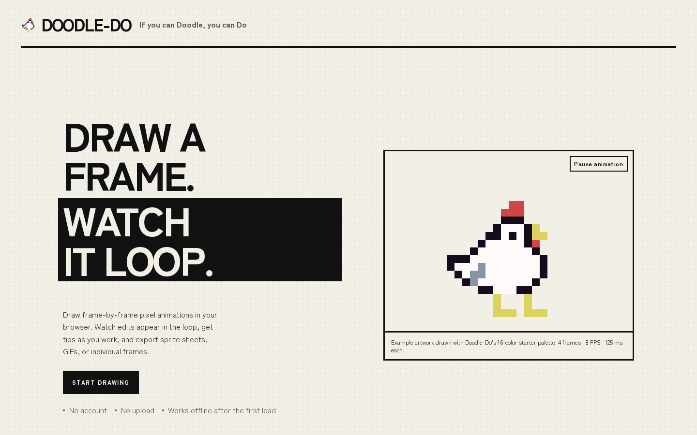
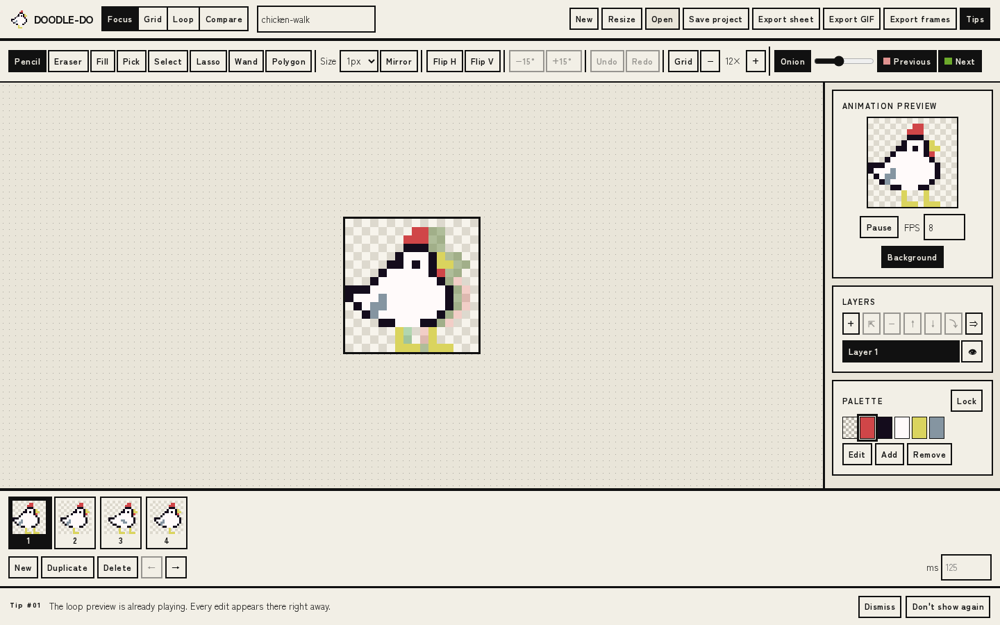
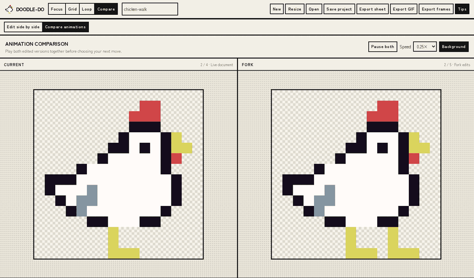

# Doodle-Do

Frame-by-frame pixel animation in the browser, with contextual tips that teach animation while you work.

Doodle-Do is local-first: there are no accounts or uploads, autosaves stay in the browser, and editable projects can be saved to disk. It exports engine-ready sprite sheets, animated GIFs, and individual frame PNGs.



## Features

- Focus, Grid, Loop, and Compare views over the same document and editing history
- Pencil, eraser, fill, eyedropper, rectangle, lasso, wand, and polygon tools
- Onion skinning, mirror drawing, layers, bulk frame edits, and full undo/redo
- Palette editing and locking with a 64-color cap and 1-bit transparency
- 27 contextual, non-blocking animation tips that can be dismissed permanently
- Local autosave using OPFS with an IndexedDB fallback
- Offline support after the first load
- Keyboard-driven editing and workspace navigation



### Compare versions

Compare creates an independent fork beside the current animation. Edit both versions, play them together, then save or export either one—or apply the fork when it wins.



## Quick start

### Requirements

- Node.js `20.19+` or `22.12+`
- npm

### Run locally

```sh
npm ci
npm run dev
```

Open the local URL printed by Vite. For a production build:

```sh
npm run build
npm run preview
```

## Using Doodle-Do

1. Open the editor and create a canvas or import an existing project.
2. Draw in Focus mode, compare frames in Grid mode, review timing in Loop mode, or fork an animation in Compare mode.
3. Add or duplicate frames, adjust per-frame timing, and organize artwork with layers.
4. Save a `.doodledo` project file for an editable copy you control.
5. Export the format your game or sharing workflow needs.

### Keyboard shortcuts

| Action | Shortcut |
| --- | --- |
| Focus / Grid / Loop / Compare view | `1` / `2` / `3` / `4` |
| Pencil / Eraser / Fill / Eyedropper | `B` / `E` / `G` / `I` |
| Rectangle / Lasso / Wand / Polygon selection | `M` / `L` / `W` / `P` |
| Change brush size | `[` / `]` |
| Move the pixel cursor or nudge a selection | Arrow keys |
| Change frames | `Page Up` / `Page Down` |

## Files and exports

### Import

The Open action accepts:

- `.doodledo` project files
- Doodle-Do project JSON
- Horizontal sprite-strip PNGs where each frame is square
- A strip PNG plus an optional `animations.json` containing per-frame timing

Imports are validated by content. Ambiguous selections are rejected instead of guessed. Images with more than 64 colors are quantized, and alpha is thresholded at 128 because artwork uses 1-bit transparency.

### Export

| Export | Output |
| --- | --- |
| Sprite sheet | PNG, TexturePacker JSON-hash, and `*.doodledo.json` |
| Animated preview | GIF with per-frame timing |
| Individual frames | One PNG per frame in a ZIP archive |
| Editable project | `.doodledo` project file |

Sprite-sheet output is verified against stock Phaser and Godot workflows. The compact `*.doodledo.json` manifest is intended for custom engines and includes the image name, frame size, FPS, and frame rectangles with durations.

## Architecture

```text
src/lib/core/    Pure document model, commands, structural edits, and palette operations
src/lib/editor/  Editor session, command bus, history, and non-undoable view state
src/lib/tools/   Drawing, fill, selection, flip, and layer command factories
src/lib/render/  Canvas compositor, onion skinning, frame cache, and loop playback
src/lib/io/      Project persistence, imports, autosave, and exporters
src/lib/modes/   Shared workspace shell plus Focus, Grid, Loop, and Compare views
src/lib/learn/   Contextual teaching-tip engine
e2e/             Playwright end-to-end coverage
bench/           Stroke-to-loop performance gate
scripts/         Phaser and Godot export verification
```

The core stays independent of the DOM. All four workspace modes preserve the current document, selected frame, zoom, palette, and history. Compare adds an independent fork that can be edited, saved, exported, swapped with the current animation, or applied to it.

## Development

| Command | Purpose |
| --- | --- |
| `npm run check` | Run Svelte and TypeScript checks |
| `npm run test` | Run unit tests with Vitest |
| `npm run test:e2e` | Run Playwright end-to-end tests |
| `npm run bench` | Measure the stroke-to-loop rendering budget |
| `npm run verify:phaser` | Load a real export in stock Phaser |
| `npm run verify:godot` | Verify a real export with Godot engine primitives |
| `npm run build` | Create the static production build |

The rendering gate targets a 16 ms stroke-to-loop cycle; the current benchmark reports a 0.1 ms p95. See [bench/README.md](bench/README.md) for the method and latest recorded run.

## Contributing

Keep changes small and follow the existing separation between the pure core, editor session, and Svelte views. Before submitting a change, run:

```sh
npm run check
npm run test
npm run build
```

Run the relevant end-to-end, benchmark, or engine-verification command when a change touches those paths. Bug fixes should include the smallest regression test that would have caught the issue.

## Project status

Doodle-Do is under active development. The editor, learning layer, offline support, import/export workflows, and four workspace modes are implemented. The reference animation library and human usability gates remain outstanding.

## Support

Doodle-Do is free and does not require an account. If it is useful to you, you can [support its development on Buy Me a Coffee](https://buymeacoffee.com/jasonzeng).

## License

Doodle-Do's source code is available under the [MIT License](LICENSE).

The Doodle-Do name and logo are not licensed for use as trademarks. Original chicken artwork in `static/assets` is excluded from the MIT License unless stated otherwise.
